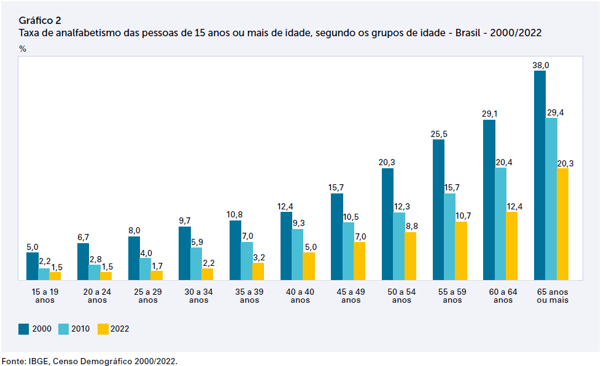

```{r setup, include=FALSE}
library(learnr)
knitr::opts_chunk$set(echo = FALSE)
```


## Endereço das Planilhas

[Dicionario de Dados Agregados por Setor Censitário](https://ftp.ibge.gov.br/Censos/Censo_Demografico_2022/Agregados_por_Setores_Censitarios/dicionario_de_dados_agregados_por_setores_censitarios.xlsx)

[Censo 2022 - Dados de Alfabetização por Municipio](https://www.ibge.gov.br/estatisticas/downloads-estatisticas.html?caminho=Censos/Censo_Demografico_2022/Agregados_por_Setores_Censitarios/Agregados_por_Municipio_csv/)

[Censo 2010 - Dados de Alfabetização por Municipio]()


[Publicação do IBGE Com Resultados Relacionados a Alfabetização](https://biblioteca.ibge.gov.br/visualizacao/periodicos/3108/cd_2022_alfabetizacao.pdf)

É apresentada aqui uma breve análise dos resultados do quesito sobre alfabetização 
presente no Questionário Básico do Censo Demográfico de 2022. Para tanto, recorre-se 
ao indicador de taxa de alfabetização das pessoas de 15 anos ou mais de idade e 
ao seu **complemento**, taxa de analfabetismo das pessoas de 15 anos ou mais de idade, 
conforme sugerido pelo documento “Princípios e Recomendações para os Censos Populacionais”, 
elaborado pela Divisão de Estatística da ONU. Os resultados são analisados em 
seis seções: desagregações por grupos de idade, cor ou raça, sexo, tamanho dos 
municípios, regiões geográficas e pessoas indígenas.

Os resultados do Censo Demográfico 2022 mostram que, no País, havia 163 milhões
de pessoas de 15 anos ou mais de idade, das quais 151,5 milhões sabiam ler e escrever
um bilhete simples e 11,4 milhões não sabiam sequer ler e escrever um bilhete simples.
A partir desses totais populacionais, a taxa de alfabetização foi 93,0% em 2022 e, 
consequentemente, a taxa de analfabetismo foi 7,0% deste contingente populacional. 

*Leitura dos Dados*

```{r Leitura, exercise = TRUE, warning=FALSE, message=FALSE, exercise.eval=TRUE}
library("tidyverse")
library("data.table")
library("abjutils")
#setwd("~/Github/DadosCenso2022")
url <- "~/GitHub/Censo2022/Dados/Agregados_por_municipios_alfabetizacao_BR.csv"
#url <- "~/GitHub/Censo2022/Dados/Agregados_por_setores_alfabetizacao_BR.csv"

dt <- fread(url,
            encoding = "Latin-1",
            sep = ";",
            header = TRUE, verbose = F)

#dt <- dt %>% select(c(1, 3:15, 107:119))
#names(dt)
#dt$NM_MUN <- str_trim(dt$NM_MUN) #Remove espacos em Branco
#dt$NM_MUN <- str_to_upper(dt$NM_MUN) #Caixa Alta
#dt$NM_MUN <- rm_accent(dt$NM_MUN) #Remove acentos
#Coluna Total Brasil

dt <- dt %>%
        mutate(Total = rowSums(select(., V00644:V00656)))
Total <- dt %>% select(Total) %>% summarise(sum(Total))
#Coluna Total de Alfabetizados do Brasil

dt <- dt %>%
        mutate(Alfab = rowSums(select(., V00748:V00760)))
Alfab <- dt %>% select(Alfab) %>% summarise(sum(Alfab))

#Coluna 65 anos ou mais por cidade

dt <- dt %>%
        mutate(V06599 = rowSums(select(., V00654, V00655, V00656)))

#Coluna 65 anos ou mais por cidade de alfabetizados
dt <- dt %>%
        mutate(V07599 = rowSums(select(., V00758, V00759, V00760)))

#Taxa de Analfabetismo por Cidade por faixa etaria
# dt[dt == 'X'] <- 0
# str(dt$V00644)
# dt$V00644 <- as.numeric(as.character(dt$V00644))
Total1519 <- sum(dt$V00644)
dt$alf1519 <- round(100*((dt$V00644-dt$V00748)/dt$V00644), digits = 1)
dt$alf2024 <- round(100*((dt$V00645-dt$V00748)/dt$V00645), digits = 1)
dt$alf2529 <- round(100*((dt$V00646-dt$V00748)/dt$V00646), digits = 1)
dt$alf3034 <- round(100*((dt$V00647-dt$V00748)/dt$V00647), digits = 1)
dt$alf3539 <- round(100*((dt$V00648-dt$V00748)/dt$V00648), digits = 1)
dt$alf4044 <- round(100*((dt$V00649-dt$V00748)/dt$V00649), digits = 1)
dt$alf4549 <- round(100*((dt$V00650-dt$V00748)/dt$V00650), digits = 1)
dt$alf5054 <- round(100*((dt$V00651-dt$V00748)/dt$V00651), digits = 1)
dt$alf5559 <- round(100*((dt$V00652-dt$V00748)/dt$V00652), digits = 1)
dt$alf6064 <- round(100*((dt$V00653-dt$V00748)/dt$V00653), digits = 1)
dt$alf6599 <- round(100*((dt$V06599-dt$V07599)/dt$V06599), digits = 1)

#Totais por cidade do Brasil

dt <- dt %>%
        mutate(Total = rowSums(select(., 3:15)))
dt <- dt %>%
        mutate(Alfabetizados = rowSums(select(., 16:28)))
dt <- dt %>% 
        mutate(NAlfabetizados = Total - Alfabetizados)
dt$TXAnalf <- round(100*((dt$Total-dt$Alfabetizados)/dt$Total), digits = 5)
#Taxa de Analfabetismo no Brasil por faixa etaria

TotBr1519 <- round(100*(sum(dt$V00644)-sum(dt$V00748))/sum(dt$V00644), digits = 1)
TotBr2024 <- round(100*(sum(dt$V00645)-sum(dt$V00749))/sum(dt$V00645), digits = 1)
TotBr2529 <- round(100*(sum(dt$V00646)-sum(dt$V00750))/sum(dt$V00646), digits = 1)
TotBr3034 <- round(100*(sum(dt$V00647)-sum(dt$V00751))/sum(dt$V00647), digits = 1)
TotBr3539 <- round(100*(sum(dt$V00648)-sum(dt$V00752))/sum(dt$V00648), digits = 1)
TotBr4044 <- round(100*(sum(dt$V00649)-sum(dt$V00753))/sum(dt$V00649), digits = 1)
TotBr4549 <- round(100*(sum(dt$V00650)-sum(dt$V00754))/sum(dt$V00650), digits = 1)
TotBr5054 <- round(100*(sum(dt$V00651)-sum(dt$V00755))/sum(dt$V00651), digits = 1)
TotBr5559 <- round(100*(sum(dt$V00652)-sum(dt$V00756))/sum(dt$V00652), digits = 1)
TotBr6064 <- round(100*(sum(dt$V00653)-sum(dt$V00757))/sum(dt$V00653), digits = 1)
TotBr6599 <- round(100*(sum(dt$V06599)-sum(dt$V07599))/sum(dt$V06599), digits = 1)
#TotBr6599 <- round(100*(sum(c(dt$V00654, dt$V00655, dt$V00656))-sum(c(dt$V00758, dt$V00759, dt$V00760)))/sum(c(dt$V00654, dt$V00655, dt$V00656)), digits = 1)
# Combinar todas as variáveis em uma lista para exibição
# Criar o data.frame
resultado <- data.frame(
        "15 a 19 anos" = TotBr1519,
        "20 a 24 anos" = TotBr2024,
        "25 a 29 anos" = TotBr2529,
        "30 a 34 anos" = TotBr3034,
        "35 a 39 anos" = TotBr3539,
        "40 a 44 anos" = TotBr4044,
        "45 a 49 anos" = TotBr4549,
        "50 a 54 anos" = TotBr5054,
        "55 a 59 anos" = TotBr5559,
        "60 a 64 anos" = TotBr6064,
        "65 ou mais"  = TotBr6599,
        row.names = "Censo 2022", # Define o nome da linha como 'Censo 2022'
        check.names = FALSE
)

# Exibir o resultado
htmlTable::htmlTable(resultado, caption = "Taxa de Não Alfabetizados")

```

A Publicação do IBGE Com Resultados Relacionados a Alfabetização cujo link foi 
indicado no inicio deste texto apresenta o gráfico de barras abaixo.



###  


Write the R code required to add two plus two:

```{r two-plus-two, exercise=TRUE}

```

### Exercise with Code

*Here's an exercise with some prepopulated code as well as `exercise.lines = 5` to provide a bit more initial room to work.*

Now write a function that adds any two numbers and then call it:

```{r add-function, exercise=TRUE, exercise.lines = 5}
add <- function() {
  
}
```

## Topic 2

### Exercise with Hint

*Here's an exercise where the chunk is pre-evaluated via the `exercise.eval` option (so the user can see the default output we'd like them to customize). We also add a "hint" to the correct solution via the chunk immediate below labeled `print-limit-hint`.*

Modify the following code to limit the number of rows printed to 5:

```{r print-limit, exercise=TRUE, exercise.eval=TRUE}
mtcars
```

```{r print-limit-hint}
head(mtcars)
```

### Quiz

*You can include any number of single or multiple choice questions as a quiz. Use the `question` function to define a question and the `quiz` function for grouping multiple questions together.*

Some questions to verify that you understand the purposes of various base and recommended R packages:

```{r quiz}
quiz(
  question("Which package contains functions for installing other R packages?",
    answer("base"),
    answer("tools"),
    answer("utils", correct = TRUE),
    answer("codetools")
  ),
  question("Which of the R packages listed below are used to create plots?",
    answer("lattice", correct = TRUE),
    answer("tools"),
    answer("stats"),
    answer("grid", correct = TRUE)
  )
)
```

